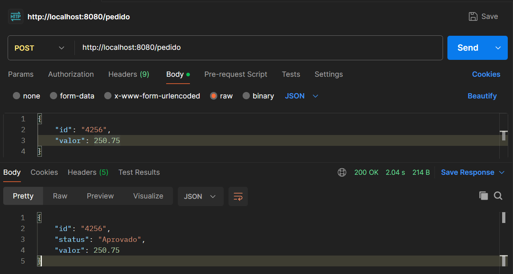

# ponderada-prog_m9s5
&emsp; Este serviço simula um processo de integração entre um sistema de pedidos e um sistema de pagamentos utilizando API REST. O objetivo é garantir que, sempre que um pedido for criado, ele seja automaticamente enviado para processamento de pagamento, e o resultado seja armazenado no sistema.

## a) Identificar e descrever a estrutura de integração, indicando camadas, módulos, componentes, serviços, hardware, software, processos 

### Estrutura da Integração

#### Camadas e Componentes
&emsp; O sistema segue uma arquitetura em camadas, garantindo uma separação clara de responsabilidades e facilitando a manutenção e escalabilidade.

1. **Camada de Apresentação:** Interface que o usuário interage com os senviços.
    - Aplicação cliente

2. **Camada de Serviço:** Contém os serviços de negócio, que processam as regras do sistema
    - [Serviço de Pedidos](services\order-service\app.py)
 → Gerencia a criação e status dos pedidos.
    - [Serviço de Pagamento](services\payment-service\app.py)
 → Processa pagamentos e retorna se foram aprovados ou recusados.

3. **Camada de Comunicação:** Responsável por definir como os serviços se comunicam
    - Foi utilizado API REST para troca de informações entre serviços.
    - Os serviços usam o protocolo HTTP/HTTPS para enviar e receber dados em formato JSON.

4. **Camada de Infraestrutura:** Fornece os recursos básicos para a aplicação rodar
    - Banco de Dados: Responsável por armazenar pedidos e pagamentos.
    - Servidor em cloud: Responsável por hospedadar o serviço em algum servidor na nuvem e/ou local.

#### Fluxo de Integração
1. O usuário faz um pedido no sistema.

2. O serviço de pedidos registra o pedido e chama o serviço de pagamento.

3. O serviço de pagamento processa o pagamento e retorna o status.

4. O serviço de pedidos atualiza o banco de dados com o resultado.

A troca de informações entre esses dois sistemas separados via API REST caracteriza a integração, unindo o serviço de pedidos com o de pagamento.

## b) Mostrar como documentar e codificar o controle de qualidade de integração. O controle deve incluir tempos, protocolos, versões e tratamento de exceções.

### Controle de Qualidade da Integração
Para garantir a qualidade da integração, foram considerados:
- Tempo de resposta: Timeout de 5s na chamada do serviço de pagamento.

- Protocolo: Comunicação via HTTP/JSON.

- Versões: Versão do serviço definida no cabeçalho HTTP.

- Tratamento de exceções: 
    - Timeout (5s): Se a API de pagamento demorar mais de 5s para responder, o status será "Falha - Tempo excedido".

    - Erro geral: Se houver outro problema na requisição, o status será "Falha".

## Teste realizado no postman

